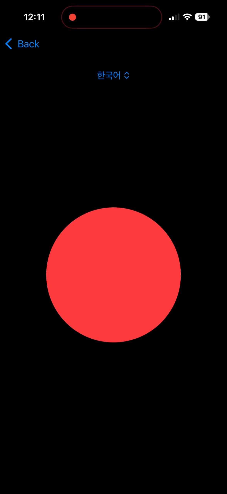
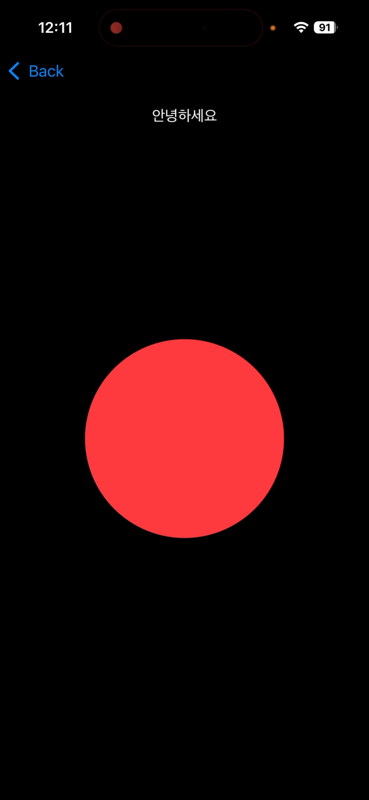
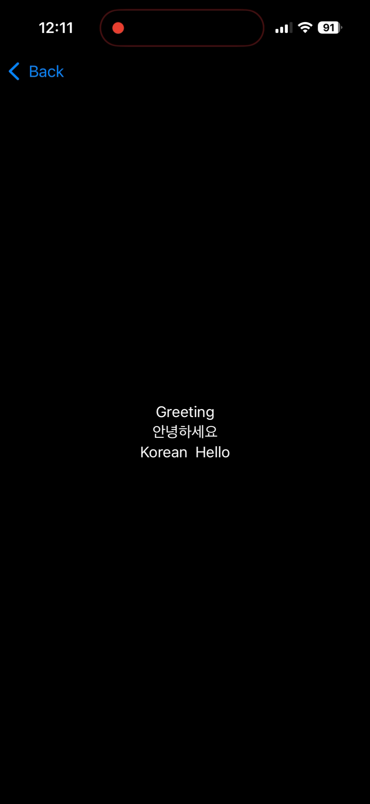

# 와락

<table>
  <tr>
    <td></td>
    <td></td>
    <td></td>
  </tr>
</table>

와락은 갑자기 와락 쏟아지는 영감과 감정을 가장 쉽게 담는 방법은 무엇일까? 라는 질문에서 출발한 앱입니다. 오가나이저 중 한 명이었던 저 밥이 당직을 서면서 기획했어요. 구현은... CodeOnStage가 끝난 지 한참 지나고 시작했고요...

커다란 녹음 버튼을 누르면 Speech Recognition이 시작되고, 다시 버튼을 누르면 AI를 통해 제목과 키워드가 추출되어 전사된 내용과 함께 저장되요. 일단 그게 끝입니다.

원래는 "와락클락"으로 시작해 컴패니언 Watch 앱도 만들어보자는 아이디어로 시작했어요. 그게 하룻밤동안 불가능한 스케일이라는 것은 끝나고 꺠달았습니다... 그래도 와락은 [여기](https://github.com/0tak2/Warak)에서 계속 진행됩니다.
